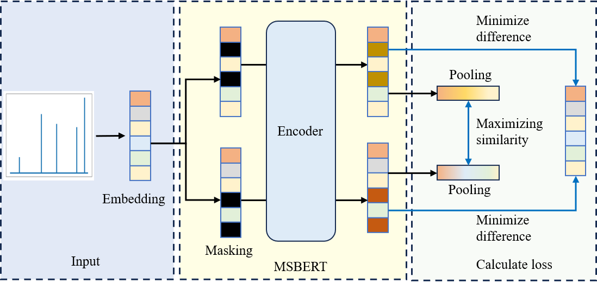

# MSBERT

MSBERT: Embedding Tandem Mass Spectra into Chemically Rational Space by Mask Learning and Contrastive Learning
# 1. Introduction
In this study, MSBERT based on mask learning and contrastive learning was proposed to get a reasonable embedding representation of MS/MS. 
MSBERT used the transformer encoder as the backbone and take advantage of the randomness of the mask to construct positive samples for contrastive learning. 
MSBERT was trained and tested on GNPS dataset. MSBERT had a stronger ability in library matching, with top 1, top5, and top 10 were 0.7871, 0.8950, and 0.9080 on Orbitrap test dataset. 
The results are significantly better than Spec2Vec and cosine similarity. 
The rationality of embedding was demonstrated by reducing the dimensionality of the embedding vectors, calculating structural similarity, and spectra clustering. 

# 2. Depends
[Anaconda](https://www.anaconda.com) for Python 3.12  
[Pytorch](https://pytorch.org/) 2.2  
# 3. Install
1.Install anaconda  
2.Install [Git](https://git-scm.com/downloads)  
3.Open commond line, create environment and enter with the following commands.   
```
conda create -n MSBERT python=3.9  
conda activate MSBERT
```
4.Clone the repository and enter.  
```
git clone https://github.com/zhanghailiangcsu/MSBERT.git
```
5.Install dependency with the following commands.
```
pip install -r requirements.txt
```
6.Install  Pytorch
```
pip3 install torch torchvision torchaudio --index-url https://download.pytorch.org/whl/cu118
```
# 4. Usage
The MSBERT is public at [homepage](https://github.com/zhanghailiangcsu), every user can download and use it.
You can download the trained model on Github.
Then refer to the example to use the model for prediction, and directly obtain the embedding vectors from MS/MS.
Alternatively, you can retrain MSBEERT on your own data refer to example.  
```
import pickle
import torch
import matplotlib.pyplot as plt
from data.ProcessData import MakeTrainData
from model.MSBERTModel import MSBERT
from model.utils import ModelEmbed, ProcessMSP,MSBERTSimilarity

# Load model
model_file = 'E:/MSBERT_model/1025/MSBERT.pkl'
model = MSBERT(100002, 512, 6, 16, 0,100,3)
model.load_state_dict(torch.load(model_file))

# Load demo file
demo_file = 'example/demo.msp'
demo_data,demo_smiles = ProcessMSP(demo_file)
demo_arr = ModelEmbed(model,demo_data,16)

#Calculate the similarity after MSBERT embedding
cos = MSBERTSimilarity(demo_arr,demo_arr)
```
If you want to use MSBERT web services, you can use the following two methods.
The first method is to use the [link](https://huggingface.co/spaces/zhanghailiangcsu/MSBERT)
The second method is to run the following code.  
```
streamlit run Web.py
```
# 5.Data available
The filtered GNPS dataset used in this experiment was uploaded to [Zenodo](https://zenodo.org/records/13347207).
# 6. About Spec2Vec
We retrained a Spec2Vec model on the filter GNPS dataset.
The training script and file(ipynb) can be accessed at the [link](https://github.com/zhanghailiangcsu/MSBERT/tree/main/Spec2VecModel).
The training data can be accessed at [link](https://zenodo.org/records/13347207).
With the uploaded script and training data, it is easy for users to repeat this part of the experiment.
# 6.Contact
Hailiang Zhang  
E-mail 2352434994@qq.com  
